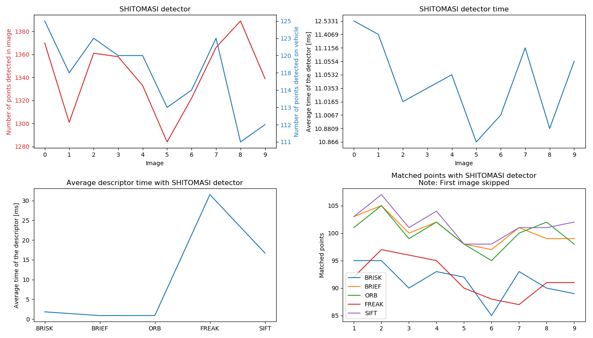

# SFND 2D Feature Tracking

The idea of the camera course is to build a collision detection system - that's the overall goal for the Final Project. As a preparation for this, you will now build the feature tracking part and test various detector / descriptor combinations to see which ones perform best. 

## Basic Build Instructions
Dependencies are listed at the end of this readme.

1. Clone this repo.
2. Make a build directory in the top level directory: `mkdir build && cd build`
3. Compile: `cmake .. && make`
4. Run it: `./2D_feature_tracking`.
5. Data analysis and data visualization can be run with: `python3 collector.py` in the top folder. 

# Midterm Project

This mid-term project had 9 tasks that needed to be done.

## MP.1 - Data Buffer
For this task a circular buffer needed to be implemented. To do this the `std::deque` container from the standard library is used. To add new elements to the container a standard `push_back()` command is used. To make it a circular buffer a check is added that compares the size of container after addition and pops the first element if it exceeds the limit of the circular buffer. This is done by using the container command `pop_front()`.

## MP.2 - Keypoint Detection
For the second task the HARRIS, FAST, BRISK, ORB, AKAZE and SIFT detectors needed to be implemented. This has been done using the implementations from OpenCV.

## MP.3 - Keypoint Detection
In the third task the detection area has been reduced to only the area of interest - the preceeding vehicle. For this the area has been defined as a class of type `cv::Rect` and by using the `contains` member method of this class a check has been made if the detected keypoint is inside the area of interest. If not, it was discarded.

## MP.4 - Descriptor Extraction & Matching
The fourth task has expanded the program by adding additional keypoint descriptors: BRISK, BRIEF, ORB, AKAZE, SIFT.

## MP.5 - Descriptor Extraction & Matching
For the fifth task different approaches to matching have been implemented: Brute-Force, FLANN, and K-Nearest-Neighbor have been added as matching options.
It is worth mentioning that different descriptors have been categorized to use either the HOG (Histogram Of Gradients) or Binary evaluation. Only SIFT uses the HOG approach, other use the binary approch.

## MP.6 - Descriptor Extraction & Matching
In this task the distance ratio test has been added as an additional filtering method for removing bad keypoint matches. The ratio of the distance is calculated for two matched keypoints. If the ratio was bigger than the given threshold (0.8) then this pair has been chosen as the correct match in order to eliminate as much of false-positives as possible.

## MP.7 - Performance Evaluation
The task wanted to run all the detectors on all 10 images and compare the results. As the metric for the distribution of the neighborhood size the ratio between keypoints on the car and all keypoints has been chosen. This way it can be seen what percentage the points in the area of interest represent compared to the whole image.
In the file `results/task7_8_9.csv` the results are represented. It can be seen by looking at the `ratio` column that ORB has detected up to 26% of all detected keypoints in the area of interest, followed by the HARRIS detector which detected up to 21% of total keypoints on the vehicle in front.

## MP.8 - Performance Evaluation
For this task all the possible combinations of detectors and descriptors needed to be tested on all 10 images and with the Brute-Force matcher the matches between images found. The results are written in `results/task7_8_9.csv` and presented below in the `Results` chapter.

## MP.9 - Performance Evaluation
For the last task the time for detection and descriptor extraction needed to be measured. The results are written in `results/task7_8_9.csv` and presented below in the `Results` chapter. Based on this information then in chapter `Conclusion` the top 3 detector/description combinations are chosen.

# Results
The results are firstly split per detector used. With each detector also combination of it with all the possible descriptors is described. At the end a proposal for top 3 detector/descriptors combinations is given.

## SHITOMASI 
First detector to be checked is the SHITOMASI detector. The SHITOMASI had detection between 111 and 123 keypoints in the area of interest between the images and took between 12ms and 24ms on average for detection of keypoints on each image.

The fastest descriptor to be used with the SHITOMASI detector has proved to be ORB with 1.3ms on average per image while averaging 90 matches per image. The combination took around 14msg on average

The results can be seen on the following chart:

## HARRIS

## FAST

## BRISK

## ORB

## AKAZE

## SIFT

# Conclusion

## Dependencies for Running Locally
* cmake >= 2.8
  * All OSes: [click here for installation instructions](https://cmake.org/install/)
* make >= 4.1 (Linux, Mac), 3.81 (Windows)
  * Linux: make is installed by default on most Linux distros
  * Mac: [install Xcode command line tools to get make](https://developer.apple.com/xcode/features/)
  * Windows: [Click here for installation instructions](http://gnuwin32.sourceforge.net/packages/make.htm)
* OpenCV >= 4.1
  * This must be compiled from source using the `-D OPENCV_ENABLE_NONFREE=ON` cmake flag for testing the SIFT and SURF detectors.
  * The OpenCV 4.1.0 source code can be found [here](https://github.com/opencv/opencv/tree/4.1.0)
* gcc/g++ >= 5.4
  * Linux: gcc / g++ is installed by default on most Linux distros
  * Mac: same deal as make - [install Xcode command line tools](https://developer.apple.com/xcode/features/)
  * Windows: recommend using [MinGW](http://www.mingw.org/)
* OPTIONAL: python3
