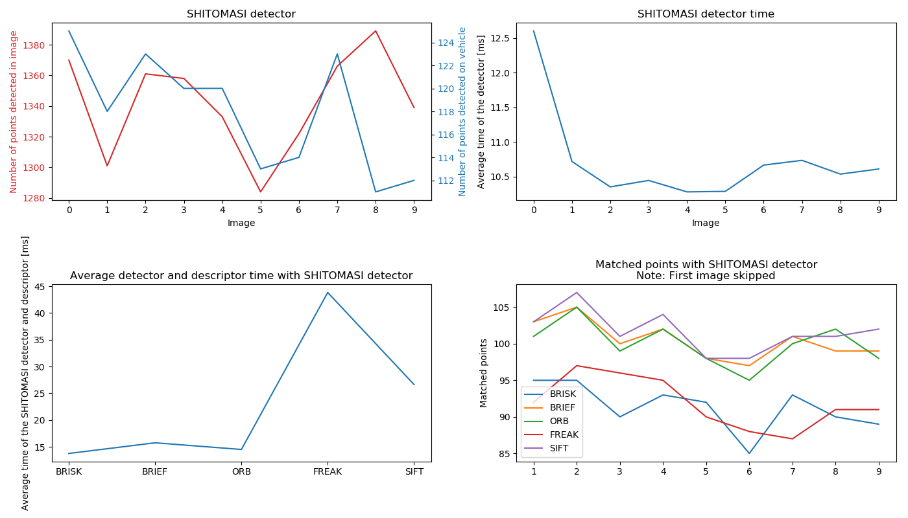
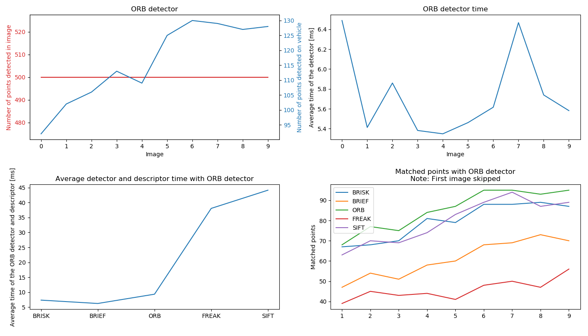
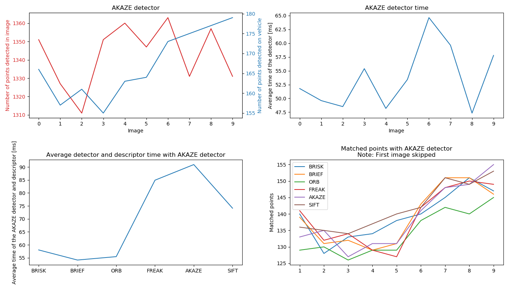
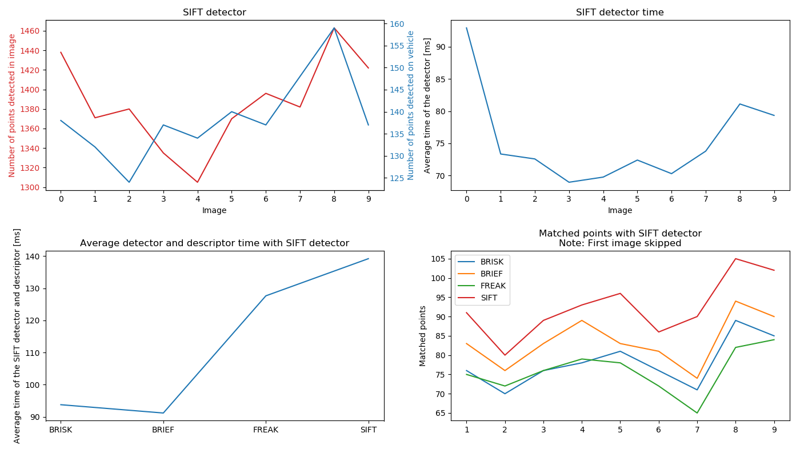

# SFND 2D Feature Tracking

This is the mid-term project for the SFND-Camera Part. 

## Basic Build Instructions
Dependencies are listed at the end of this readme.

Build & run instructions.
1. Clone this repo.
2. Make a build directory in the top level directory: `mkdir build && cd build`
3. Compile: `cmake -DCMAKE_BUILD_TYPE=Release ..  && make`
4. Run it: `./2D_feature_tracking`.
5. The arguments to the program are: `./2D_feature_tracking <VISUALIZATION> <DETECTOR> <DESCRIPTOR> <MATCHER> <SELECTOR>`
6. Data analysis and data visualization can be run with: `python3 collector.py` in the top folder. 

# Midterm Project

This mid-term project had 9 tasks that needed to be done.

## MP.1 - Data Buffer
For this task a circular buffer needed to be implemented. To do this the `std::deque` container from the standard library is used. To add new elements to the container a standard `push_back()` command is used. To make it into a circular buffer a check is added that compares the size of container after addition and pops the first element if it exceeds the limit of the circular buffer. This is done by using the container command `pop_front()`.

## MP.2 - Keypoint Detection
For the second task the HARRIS, FAST, BRISK, ORB, AKAZE and SIFT detectors needed to be implemented. This has been done using the implementations from OpenCV. The detector can be freely chosen from the list of possible detectors and input as the second argument to the program call. 

## MP.3 - Keypoint Detection
In the third task the detection area has been reduced to only the area of interest - the preceeding vehicle. For this the area has been defined as a class of type `cv::Rect` and by using the `contains` member method of this class a check has been made to check if the detected keypoint is inside the area of interest. If not, it is discarded.

## MP.4 - Descriptor Extraction & Matching
The fourth task has expanded the program by adding additional keypoint descriptors: BRISK, BRIEF, ORB, AKAZE, SIFT. As with keypoint Detectors also here the desired descriptor can be chosen as an argument to the program call. This is the third argument.

## MP.5 - Descriptor Extraction & Matching
For the fifth task different approaches to matching have been implemented: Brute-Force, FLANN, and K-Nearest-Neighbor have been added as matching options.
It is worth mentioning that different descriptors have been categorized to use either the HOG (Histogram Of Gradients) or Binary evaluation. Only SIFT uses the HOG approach, other use the binary approach.

## MP.6 - Descriptor Extraction & Matching
In this task the distance ratio test has been added as an additional filtering method for removing bad keypoint matches. The ratio of the distance is calculated for two matched keypoints. If the ratio was bigger than the given threshold (0.8) then this pair has been chosen as the correct match in order to eliminate as much of false-positives as possible.

## MP.7 - Performance Evaluation
The task wanted to run all the detectors on all 10 images and compare the results. As the metric for the distribution of the neighborhood size the ratio between keypoints on the car and all keypoints has been chosen. This way it can be seen what percentage the points in the area of interest represent compared to the whole image.
In the file `results/task7_8_9.csv` the results are represented. It can be seen by looking at the `ratio` column that ORB has detected up to 23% of all detected keypoints in the area of interest, followed by the HARRIS detector which detected up to 15% of total keypoints on the vehicle in front.

## MP.8 - Performance Evaluation
For this task all the possible combinations of detectors and descriptors needed to be tested on all 10 images and with the Brute-Force matcher the matches between images found. The results are written in `results/task7_8_9.csv` and presented below in the `Results` chapter.

## MP.9 - Performance Evaluation
For the last task the time for detection and descriptor extraction needed to be measured. The results are written in `results/task7_8_9.csv` and presented below in the `Results` chapter. Based on this information then in chapter `Conclusion` the top 3 detector/description combinations are chosen.

# Results
The results are firstly split per detector used. With each detector also combination of it with all the possible descriptors is described. At the end a proposal for top 3 detector/descriptors combinations is given.

The python script `collector.py` executes the program for all possible combinations, prepares the `.csv` table with "measurements" for each combination and additionally visualizes a figure with four plots for each detector with all possible combinations<>.

>Note on times. The program has been build using `release` cmake build option to provide the best possible optimization. Since the times are dependent on the hardware and computer usage at the given time, the times in this document are therefore just for orientation. All times are therefore also averaged and rounded to onyl one decimal point. The program has been executed on an Intel i5 processor while a chromium based browser and VS Code have been running simultaniously.

>Note on results and evaluation. During evaluation the program has been run mutliple times therefore the times in evaluation can differ with the latest values in the `.csv`, but the order of duration should be kept (i.e. the difference should be a few ms). 

## SHITOMASI 
First detector to be checked is the SHITOMASI detector. The SHITOMASI had detection between 111 and 123 keypoints in the area of interest between the images and took between 12ms on average for detection of keypoints on each image. The average ratio between total keypoints detected and keypoints on the vehicle was 9%.

The fastest descriptor to be used with the SHITOMASI detector has proved to be BRIEF with 1.4ms on average per image while averaging 90.4 matches per image. The fastest combinations has proven to be SHITOMASI + BRIEF with average around 13ms for detection and descriptions of keypoints in each image. As can be seen from the fourth plot in the following chart the number of matches using BRIEF is also being one of the top ones for the SHITOMASI detector.

The results can be seen on the following chart:

## HARRIS

HARRIS detector is the second detector checked. Interestingly the sixth image seems to be far better for the HARRIS detector as other ones since the number of detected keypoints jumps up to 383 in that image. HARRIS detector averaged 173.7 keypoints per image. Average detection time is around 11ms. The average ratio between total keypoints detected and keypoints on the vehicle was 15%.

As the case with SHITOMASI also with HARRIS detector BRIEF seems to be the fastest descriptor. The average time of the BRIEF descriptor using HARRIS detected keypoints is around 0.6ms. The average time for detection and description are around 11.5ms with average of 16 matches per image.

The results can be seen on the following chart:

## FAST

Next detector tested was the FAST detector. Compared to previous detectors the FAST detector detected quite a lot of keypoints, averaging 4920.4 keypoints per image. But only 8% of it were keypoints on the preceeding vehicle and therefore of use for the desired application. Nevertheless, the detector only took around 1.7ms per image for detection. 

The fastest descriptor to be used with FAST is ORB, averaging 1.3ms per image with 258.6 matches per image (total 2.91ms), closely followed by the BRIEF descriptor averaging 1.4ms in description time (total 3.1ms) and 259.6 matches per image. 

The results can be seen on the following chart:

## BRISK

The BRISK detector average 2711.6 keypoints per image with 10% being on the vehicle of interest. But average detection time of 256.4ms per image makes it far slower than the previous combinations. 

The fastest descriptor to be used with BRISK detected keypoints is BRIEF averaging 0.9ms per image. Total time for this combination is in average 259.3ms with 155 matches per image. 

The results can be seen on the following chart:

## ORB

The ORB detector continuously maxed out at 500 keypoints detected. This maximum value comes from the presets of OpenCV. Since for all detectors default values have been used also for ORB no changes have been made. The average time for detection is about 5.7ms while averaging 500 keypoints per image with 23% being on the vehicle of interest.

The fastest combination with ORB seems to be BRIEF. BRIEF took 0.5ms on average per image while averaging 55 matches per image when using ORB detected keypoints. 

The results can be seen on the following chart:

## AKAZE

The AKAZE detector average 1342.9 keypoints in the image with 12% of them being on the vehicle of interest. The average time was about 46ms for detection per image.

AKAZE detector is the only detector compatible with AKAZE descriptor, but the AKAZE descriptor was in no way better than the others, it was even the slowest. The fastest was BRIEF with average 0.6ms per image while having 125.3 matches on average per image.

The results can be seen on the following chart:

## SIFT

The SIFT detector was the last one evaluated. While averaging 1386.2 keypoints per image the average execution time was around 90ms while only 10% of the detected keypoints were in the are of interest. 

The fastest descriptor to use with SIFT detector is te BRIEF descriptor which averages 0.8ms per image with 75.3 matches per image.

The results can be seen on the following chart:

# Conclusion

The final task of this mid-term project was to propose TOP3 combinations of detectors and descriptors.

Of course it would be simple to just search for the fastest combination. But for the given usecase it is of importance for the combination to detect as much keypoints on the vehicle in front while also not bein too slow.

Since in most cases the detector was the slowest part, here is a list of all detectors, their times and average ratio (ratio between keypoints on the vehicle of interest and total keypoints in image):

| Detector | Average Time [ms] | Ratio [%] |
| -------- | ------------:     | --------: | 
| SHITOMASI | 12 | 9 |
| HARRIS | 11 | 10 |
| FAST | 1.6 | 8 |
| BRISK | 260 | 10 |
| ORB | 6 | 23 |
| AKAZE | 46 | 12 |
| SIFT | 90 | 10

From the table it can be seen that the FAST detector is the fastest one while still not deviating too much from others in terms of the detection ratio (ORB excluded).

For FAST the top 3 fastest descriptors are:
| Detector | Descriptor | Time [ms] | Matches | Total Time [ms]
| -------- | ---------- | --------: | ------: | ------:
| FAST     | ORB        | 1.4      | 258.6   | 2.97
| FAST     | BRIEF      | 1.4      | 259.6   | 3.14
| FAST     | BRISK      | 3.9      | 239.5   | 5.5

For ORB the top 3 fastest descriptors are:
| Detector | Descriptor | Time [ms] | Matches | Total Time [ms]
| -------- | ---------- | --------: | ------: | ------:
| ORB      | BRIEF      | 0.5       | 55      | 6.22
| ORB      | BRISK      | 1.3       | 71.7    | 7.34
| ORB      | ORB        | 3.5       | 76.9    | 9.33

As can be seen from the top two tables, the combinations with FAST descriptors are not only twice as fast but also have around 3.7 times as much matches as the ORB detectors` combinations. It would be interesting to check how the ORB detector with bigger features parameter changes in regard to the matches and time. But for this task the ORB detector has not proven to be sufficient.

# Proposal
The proposal would therefore be the FAST detector with the following combinations:
|   | Detector | Descriptor |
|-- | -------- | ---------- |
| 1 | FAST     | ORB        |
| 2 | FAST     | BRIEF      |
| 3 | FAST     | BRISK      |

------------------------

## Dependencies for Running Locally
* cmake >= 2.8
  * All OSes: [click here for installation instructions](https://cmake.org/install/)
* make >= 4.1 (Linux, Mac), 3.81 (Windows)
  * Linux: make is installed by default on most Linux distros
  * Mac: [install Xcode command line tools to get make](https://developer.apple.com/xcode/features/)
  * Windows: [Click here for installation instructions](http://gnuwin32.sourceforge.net/packages/make.htm)
* OpenCV >= 4.1
  * This must be compiled from source using the `-D OPENCV_ENABLE_NONFREE=ON` cmake flag for testing the SIFT and SURF detectors.
  * The OpenCV 4.1.0 source code can be found [here](https://github.com/opencv/opencv/tree/4.1.0)
* gcc/g++ >= 5.4
  * Linux: gcc / g++ is installed by default on most Linux distros
  * Mac: same deal as make - [install Xcode command line tools](https://developer.apple.com/xcode/features/)
  * Windows: recommend using [MinGW](http://www.mingw.org/)
* OPTIONAL: python3
